# PRATIKUM 5 
## PENEJELASAN KODE PEMROGRAMAN 

### data_mahasiswa 
- Sebuah dictionary yang menyimpan semua data mahasiswa. 
- Dictionary ini menyimpan informasi mahasiswa, dengan NIM sebagai key dan data mahasiswa(berupa nama, tugas, UTS dan nilai akhir) Sebagai value. 

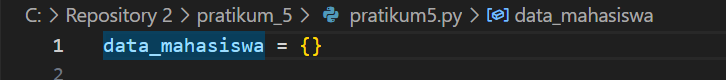

### Fungsi tampilkan_data()
- Fungsi digunakan untuk menampikan data mahasiswa dalam bentuk tabel. 
- HeadeR tabel menggunakan format string agar data tersusun rapi. 
- Jika data_mahasiswa kosong, maka akan terdapat pesan "Tidak ada data". 
- Menggunakan enumerate() untuk memberikan nomor urut pada data. 

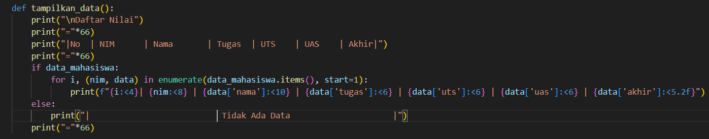

### Fungsi tambah_data()
- Menambahkan data mahasiswa ke dalam dictionary 
- Nilai akhir dihitung dihitung menggunakan rumus NILAI AKHIR = (Tugas x 30%) + (UTS x 35%) + (UAS x 35%)
- Hasil perhitungan nilai akhir disimpan bersama data mahasiswa. 
- Apabila input nilai bukan angka, maka program akan menampilkan pesan error tanpa berhenti.

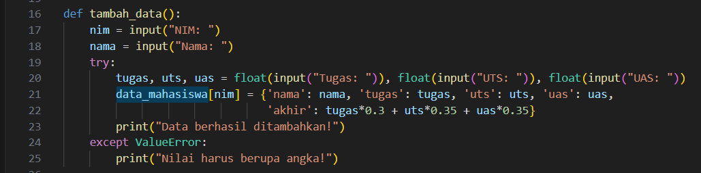

### Fungsi ubah_data()
- Mengubah data mahasiswa berdasarkan NIM. Program akan mencari data berdasarkan NIM.
- Jika NIM ditemukan fungsi tambah_data() dipanggil untuk mengganti data dengan data baru. 
- Jika NIM tidak ditemukan, muncul pesan "Data tidak ditemukan". 

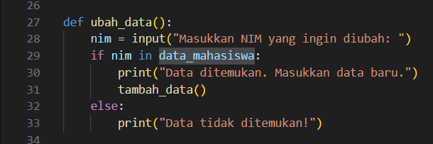

### Fungsi hapus_data()
- Fungsi ini digunakan untuk menghapus data mahasiswa dari dictionary berdasarkan NIM. 
- Menggunakan fungsi pop() untuk menghapus data mahasiswa. 
- Jika NIM ditemukan, data dihapus, dan muncul pesan "Data berhasil dihapus" 

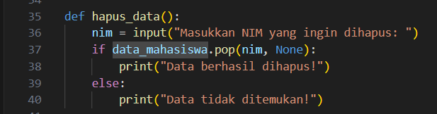

### Fungsi cari_data()
- Fungsi ini digunakan untuk mencari dan menampilkan detail data mahasiswa berdasarkan NIM. 
- Apabila NIM ditemukan, detail mahasiswa(nama, tugas, UTS, UAS, nilai akhir) ditampilkan. 
- Apabila data tidak ditemukan maka akan muncul sebuah pesan. 

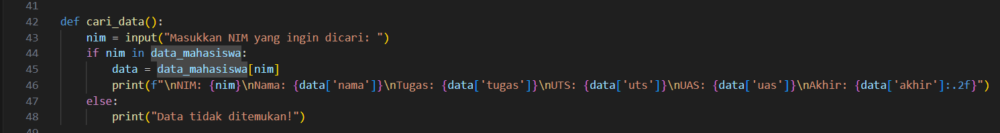

### Fungsi menu()
- Fungsi ini menampilkan menu utama yang memungkinkan kita untuk memilih opsi yang tersedia. 

- Opsi Menu: 
- (L)ihat: Ketik L untuk menampilan data mahasiswa
- (T)ambah: Ketik T untuk menambahkan data baru
- (U)bah: Ketik K Mengubah data berdasarkan NIM 
- (H)apus: Ketik H Menghapus data berdasarkan NIM 
- (C)ari: Ketik C Mencari data berdasarkan NIM
- (K)eluar:Ketik K Mengakhiri program 

- Apabila memilih opsi selain yang disediakan makan input tidak valid. 

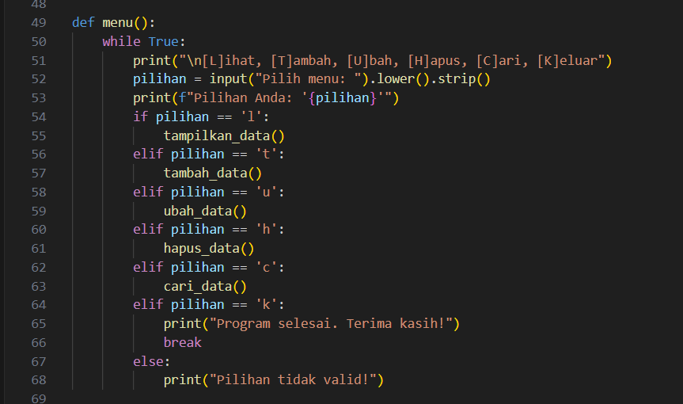

### CARA KERJA PROGRAM 
1. Program akan dimulai dengan memanggil fungsi menu()
2. Pengguna memilih satu opsi. 
    - (L)ihat: menampilan data mahasiswa
    - (T)ambah: menambahkan data baru
    - (U)bah: Mengubah data berdasarkan NIM 
    - (H)apus: Menghapus data berdasarkan NIM 
    - (C)ari: Mencari data berdasarkan NIM
    - (K)eluar: Mengakhiri program 
3. Program akan terus berjalan hingga kita memilih opsi K untuk keluar dari program. 

### KODE PRORAM 

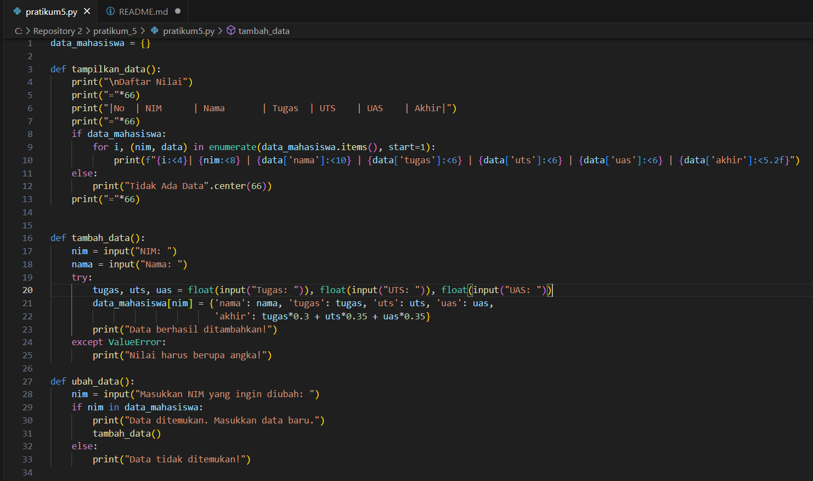

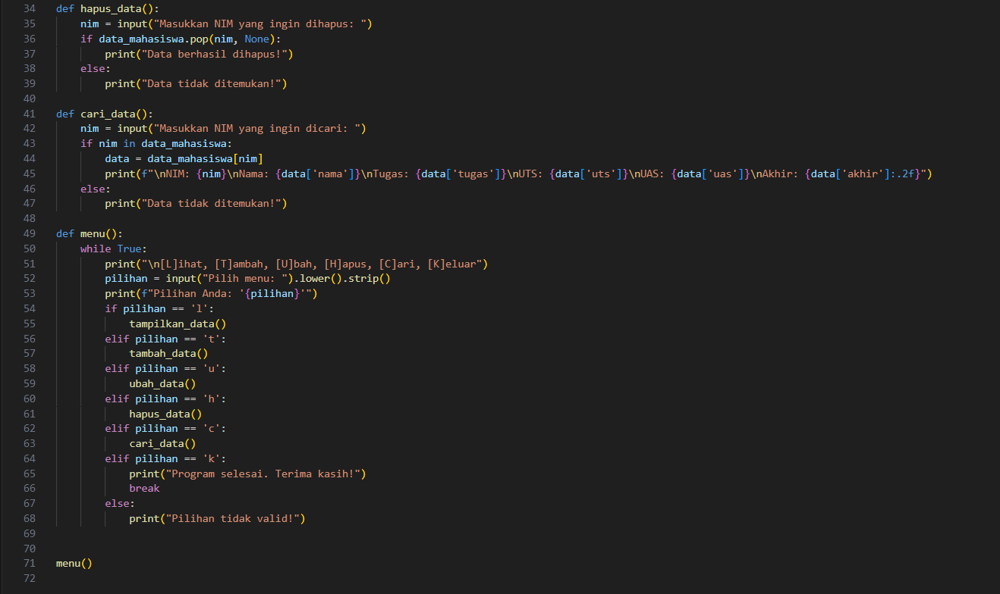

### Hasil kode Program 
Berikut merupakan hasil dari kode program apabila tidak ada data yang diinputkan. 

Berikut merupakan hasil dari kode program apabila terdapat data yang diinputkan. 

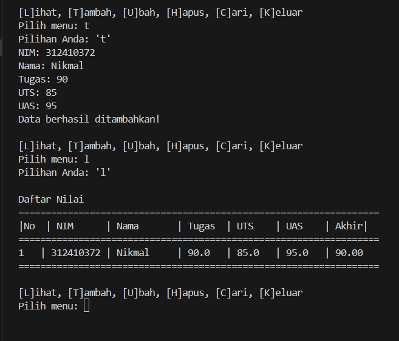

### FLOWCHART 

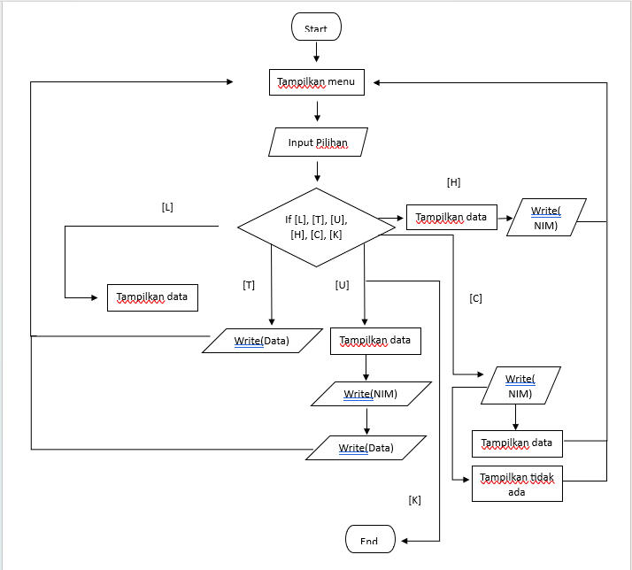

## MULAI PROGRAM
- Program dimulai dengan menginisialisasi dictionary kosong data_mahasiswa untuk menyimpan data mahasiswa. 

## Tampilkan menu. 
- Program akan menampilkan menu utama seperti berikut:
    - (L)ihat: menampilan data mahasiswa
    - (T)ambah: menambahkan data baru
    - (U)bah: Mengubah data berdasarkan NIM 
    - (H)apus: Menghapus data berdasarkan NIM 
    - (C)ari: Mencari data berdasarkan NIM
    - (K)eluar: Mengakhiri program 

## Input Pilihan 
Program akan meminta pengguna untuk memasukkan pilihan. 

## Keputusan Pilihan 
Praogram akan memeriksa apakah pilihan pengguna valid 
- Jika Valid maka maka program akan melanjutkan proses sesuai dengan pilihan. 
    - (L)ihat: menampilan data mahasiswa
    - (T)ambah: menambahkan data baru
    - (U)bah: Mengubah data berdasarkan NIM 
    - (H)apus: Menghapus data berdasarkan NIM 
    - (C)ari: Mencari data berdasarkan NIM
    - (K)eluar: Mengakhiri program 
- Jika tidak valid
    - Tampilkan pesan "Pilihan tidak valid"
    - Kembali ke menu 

## Proses berdasarkan pilihan 
- Lihat 
    - Jika data mahasiswa kosong maka program akan menampilkan pesan "Tidak ada data" 
    - Jika ada data maka program akan menampilkan data mahasiswa NIM, Nama Mahasiswa, Nilai Tugas, UTS, dan UAS
- Tambah 
    - Input NIM, Nama, Nlai Tugas, UTS Dan UAS. 
    - Program akan menghitung keseluruhan nilai dengan rumus 
      akhir = Tugas * 0,3 + UTS * 3,5 + UAS * 3,5 
    - Program akan menyimpan data ke dictionary dan program akan menampilkan pesan "Data berhasil ditambahkan"
- Input 
    - Input NIM yang ingin diubah 
    - Program akan memeriksa apakah NIM ditemukan atau tidak
    - Jika ditemukan maka program akan meminta data baru dan program akan memperbaruinya. 
    - Jika tidak ditemukan maka program akan menampilkan pesan " Data tidak ditemukan" 
- Hapus 
    - Input NIM yang ingin dihapus 
    - Program akan memeriksa NIM 
    - Jika ditemukan: Hapus data dictionary
    - Jika tidak ditemukan maka program akan menampilkan pesan " Data tidak ditemukan"

- Cari 
    - Input NIM mahasiswa yang ingin dicari 
    - Program akan memeriksa NIM 
    - Jika ditemukan program akan menampilkan Data
    - Jika tidak ditemukan maka program akan menampilkan pesan " Data tidak ditemukan"
- Keluar 
    - Jika kita memilih Keluar, program akan selesai 
